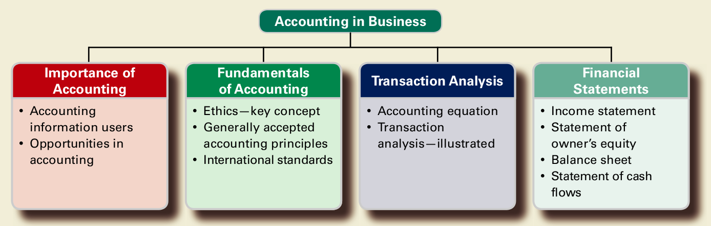

### 15/11/2022

*1*01
^ assets

10*1*
    ^ cash
	
10*2*
   ^ receivable
   

U.S GAAP
U.K GAAP IFRS
GAAP = Generally Accepted Accounting Priciples

Rule box Standard may be applicatable to western countries but not applicatable to our shit country

Priciple base Standard

SEC = Securtiy Exchange Commisions
The SEC is responsible for monitoring the standards to be applicable to the global world

Income Statements shows your revenue minus expenses 
Statement of profit or loss
Statement of owner's equity/capital
Statement of Cashflow

US GAAP
1. Income Statement
2. Statement of Owner's Equity/Capital
3. Balance Sheet

UK GAAP IFRS
1. Statement of Profits or Loss
2. Statement of Capital
3. Statement of Financial Position