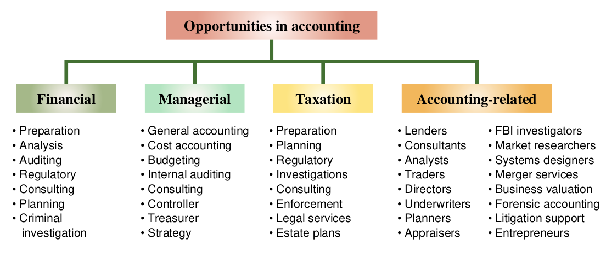

### 17/11/2022

### Equation of Accounting

Assets = Capital + Liabilities
&nbsp;&nbsp;&nbsp;&nbsp;&nbsp;&nbsp;&nbsp;&nbsp;&nbsp;&nbsp;&nbsp;&nbsp;&nbsp;&nbsp;&nbsp;Owners&nbsp;&nbsp;&nbsp;Creditors

**Accounting** is an information and measurement system that identifies, records, and communicates relevant, reliable, and comparable information about an organization's business activities.

Accounting is often called the language of business because all organizations set up an accounting information system to communicate data to help people make better decisions.

**Accounting information system** serves 2 kinds of users:
- External Users (Lenders, Shareholders, Governemnts, Consumer Groups, External Auditors , Customers)
- Internal Users (Officers, Managers, Internal Auditors, Sales Staff, Budget Officer, Controllers)

**Charter** includes how many shares/stocks allow for the corp to sell (prolly mistyped)

For 1 share there is a specific par value for it. (ex: 1 share is 1$ kind of thing?)

During elections, each share is considered 1 vote. A shareholder with 50% of the stocks would have full control (reference iron fist)

### Next week, discuss fundementals of accounting