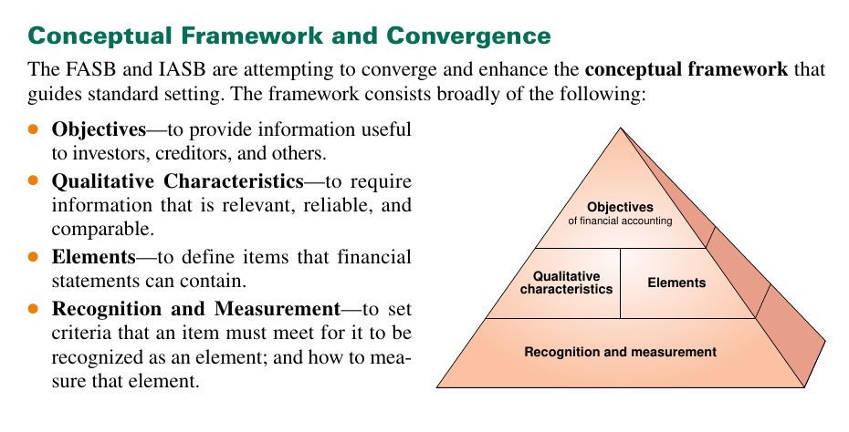

### 22/11/22

U.S GAAP is issued by FASB
FASB = Financial Accoutning Standard Board

Assets = Liabilities + Equity/Capitol

U.K GAAP ( IFRS is issued by IASB
IASB = International Accounting Standard Board

Assets = Capiital + Liabilities

