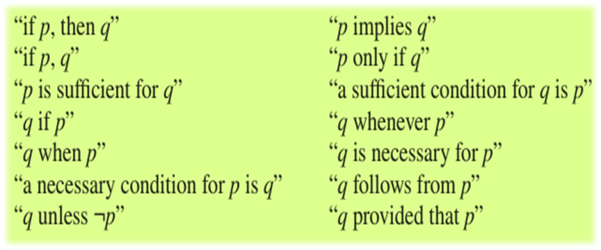

## What is Discrete Mathematics?

A part of mathematics devoted to the study of discrete objects.

Used whenever objects are counted, relationships of finite sets are studied

### Discrete

Consisting of distint or unconnected or non-continuous elements or structure.

## Problems solved using Discrete Mathematics

- Ways to choose a valid password on a computer system
- Linkage between 2 computers in a network
- Steps required to sort
- Google's fast search engine

## Importants of Discrete Mathematics

- Information stored and manipulated by computers in discrete fashion
- Applications in many different areas
- DMath is a gateway to more advanced courses

## Proposistions

- Basic building blocks of logic
- A declarative statement that is either true or false

Examples:

- (RiceName) is the best rice in 2012, 2013, 2014 (True)
- 1 + 1 = 0 (False)

Not propositions:

- Read this carefully
- What time is it?

## Logical Operators

### Negation (¬)

Let *p* be the proposition. The negation of *p* is denoted by ¬p

(Think of this as the NOT operation or !)
Example:

- p: ?
- ¬p: "It is not the case that p"

#### Truth Table

| p   | ¬p  |
| --- | --- |
| T   | F   |
| F   | T   |

### Conjunction (∧)

Conjunction of p and q is denoted by p∧q

This conjunction is true only when p and q are true

#### Truth Table

| p   | q   | p∧q |
| --- | --- | --- |
| T   | T   | T   |
| T   | F   | F   |
| F   | T   | F   |
| F   | F   | F   |

### DisConjunction (∨)

Let p and q be propositions. The conjunction of p and q are denoted by p∨q.

This conjunction is false when both p and q are false.
(OR operator ||)

#### Truth Table

| p   | q   | p∨q |
| --- | --- | --- |
| T   | T   | T   |
| T   | F   | T   |
| F   | T   | T   |
| F   | F   | F   |

### Exclusive OR (⊕)

Let p and q be props. Exlusive of p and q are denoted by p⊕q.

p⊕q is true when only 1 of them is true.
(XOR operator)

#### Truth Table

| p   | q   | p⊕q |
| --- | --- | --- |
| T   | T   | F   |
| T   | F   | T   |
| F   | T   | T   |
| F   | F   | F   |

### Conditional Statement / Implication (→)

p→q is false, when p is true and q is false, and true otherwise.

p is refered to a hypothesis(or antecedent or premise) and q is called the conclusion(or consequence).

#### Truth Table

| p   | q   | p→q |
| --- | --- | --- |
| T   | T   | T   |
| T   | F   | F   |
| F   | T   | T   |
| F   | F   | T   |

#### Converted to a sentence:

### BiConditional Statements (↔)

denoted by p↔q
p↔q is true only when p and q have the same truth(not **true** value, **truth** value) value.

also called bi-implications

### Truth Table

| p   | q   | p↔q |
| --- | --- | --- |
| T   | T   | T   |
| T   | F   | F   |
| F   | T   | F   |
| F   | F   | T   |

Ways to express:
"p is necessary and sufficient for q"
"p iff q"

## Special Names for Conditional Statements

### Contrapositive

Contrapositive of p→q is the proposition ¬q→¬p

### Converse

The proposition q→p is the converse of p→q

### Inverse

The proposition ¬p→¬q is called the inverse of p→q

## Operator Precedence

In order of highest to lowest priority:

- ¬
- ^
- v
- ->
- &lt;-&gt;

| p   | q   | ¬q  | pv¬q | p^q | (pv¬q)->(p^q) |
| --- | --- | --- | --- | --- | --- |
| T   | T   | F   | T   | T   | T   |
| T   | F   | T   | T   | F   | F   |
| F   | T   | F   | F   | F   | T   |
| F   | F   | T   | T   | F   | F   |