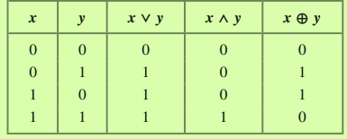
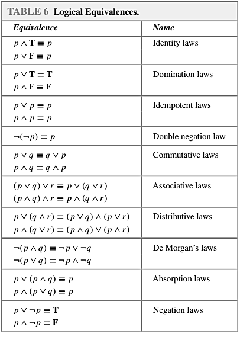
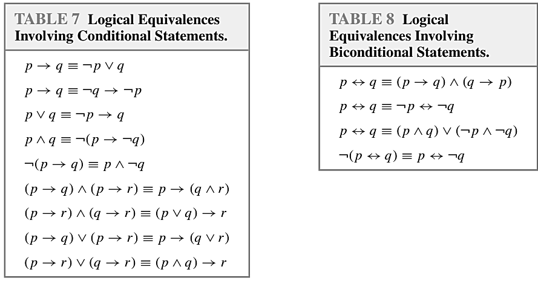

### 16/11/2022

## Logic and Bit operators

Bit is just a symbol with 2 possible values, true or false

Table of OR, AND, and XOR respectively

Statements in mathematics, sciences, and natural languages are imprecise or ambiguous.
&nbsp;&nbsp;&nbsp;&nbsp;Translated into the language of logic

## Applcations of Propositional Logic

Example:
You can access the internet from campus only if you are an information technolgoy major or you are not a sophmore.

You can access the internet from campus (p)
You are an information technology major  (q)
You are ___ a sophmore (r)

can also be converted to: p &rarr; q &or; &not;p

Example: The automated reply cannot be sent when the file system is full

The automated reply ___ sent (p)
The system is full (q)

Converted: q &rarr; &not;p

## Propositional Equivalences

**Tautology**: a compound proposition that is always **true** no matter the truth values of the propositional variables that occur in it.

Ex: Show that (p &rarr; q) &LeftRightArrow; (&not;p &or; q) is a tautology

|p|q|p &rarr; q|&not;p &or; q|(p &rarr; q) &LeftRightArrow; (&not;p &or; q)|
|-|-|----------|-------------|---------------------------------------------|
|T|T|T         |T            |T                                            |
|T|F|F         |F            |T                                            |
|F|T|T         |T            |T                                            |
|F|F|T         |T            |T                                            |

Thus, this statement is a tautology

**Contradiction**: a compound proposition that is always **false**.

Show that (p &LeftRightArrow; q) &and; (&not;p &and; q) is a contradiction

**Contingency**: a compound proposition that is neither a tautology nor a contradiction.

## Logical Equivalences

The compound propositions p and q are called logically equivalent if p &LeftRightArrow; q is a tautology.

The notation p &equiv; q denotes that p and q are logically equivalent.

Logical Equivalences:

Show that (p &and; (p &rarr; q)) &rarr; q is a tautology.
&nbsp;&nbsp;&nbsp;&nbsp;using truth tables and logical equivalences

do this at home lol

Show that &not;(p &or; (&not;p &and; q)) and &not;p &and; &not;q are logiccally equivalent

&not;(p &or; (&not;p &and; q))  De Morgan's Law 2
&not;p &and; &not;(&not;p &and; q)) De Morgan's Law 1
&not;p &and; (&not;(&not;p) &or; &not;q) Double Negation 1
&not;p &and; (p &or; &not;q) Distributive Law 2
(&not;p &and; p) &or; (&not;p &and; &not;q) Negation Laws 2
F &or; (&not;p &and; &not;q) Identity Law 2
**&not;p &and; &not;q &equiv; &not;p &and; &not;q** 
<!--fuck typing this in-->

Exercises:
Show that (p &and; q) &rarr; (p &and; q) is a tautology

(p &and; q) &rarr; (p &and; q) Conditional Statments 1
&not;(p &and; q) &or; (p &and; q) Negation Law 1
**T**

Show that &not;(&not;p &and; q) &and; (p &or; q) and p are logically equivalent
&not;(&not;p &and; q) &and; (p &or; q) De Morgans Law 1
(&not;(&not;p) &or; &not;q) &and; (p &or; q) Double Negation
(p &or; &not;q) &and; (p &or; q) Distributive Law 1
p &or; (q &and; &not;q) Negation Law 2
p &or; F Identity Law
**p &equiv; p**

