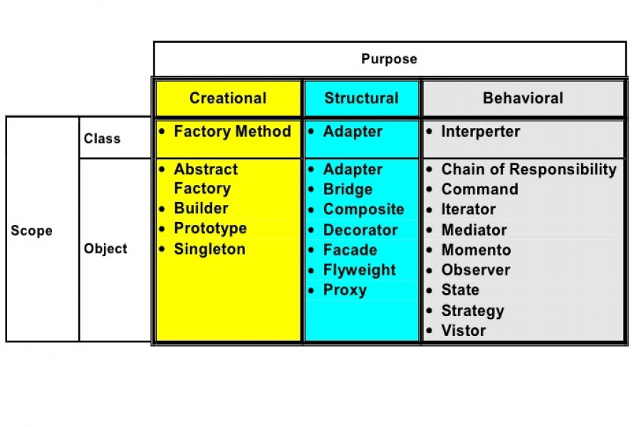

## Basic Concept of Design

### Software Design Patterns

Software Design patterns is an instrument for system analysis.

### Do a presentation on one of the design pattern
Presenters will be picked randomly.
Panelists will be picked randomly

One deisng pattern for each student (decided among themselves)

Presentation day: somewhen january (module 4 currently havent started module 1 lol)

Keywords:
- Drawing
- Pattern
- Arrangements of Parts
- Decorative Pattern
- Plan
